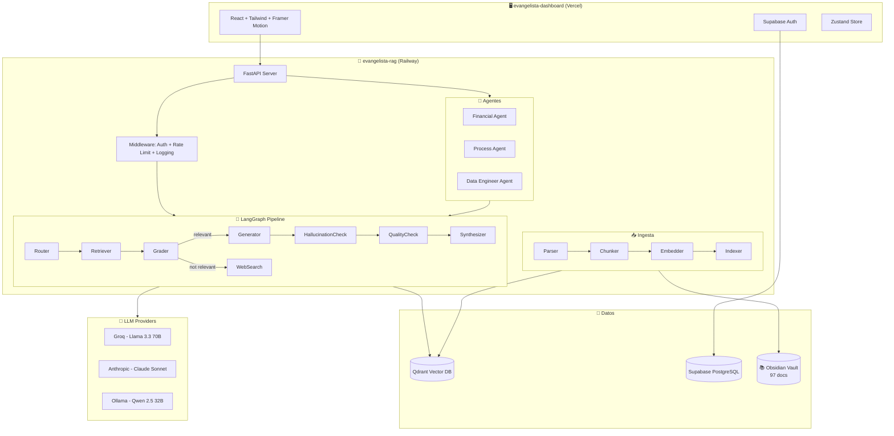

# 🗺️ MAPA GENERAL — Evangelista Intelligence Platform (EIP)

> **Última actualización**: 2026-04-05
> Consultoría estratégica asistida por IA para PyMEs mexicanas.

---

## 📁 Estructura Raíz del Proyecto

```
Evangelista-Vault/
├── evangelista-rag/          # 🔧 Backend — FastAPI + RAG Pipeline + Agentes IA
├── evangelista-dashboard/    # 🖥️ Frontend — React + Vite + Tailwind + Supabase
├── Evangelista-Obsidian/     # 📚 Base de Conocimiento — Vault de Obsidian (97 docs)
├── .claude/                  # 🧠 Documentación interna del proyecto
├── README.md                 # Instrucciones generales del proyecto
├── package.json              # Dependencia raíz (@openrouter/sdk)
├── sentinel-fraud-detection.md  # (Placeholder — módulo futuro)
└── .gitignore
```

---

## 🔧 1. Backend — `evangelista-rag/`

**Stack**: Python 3.11 · FastAPI · LangGraph · Qdrant · Multi-LLM (Groq, Anthropic, Ollama)
**Deploy**: Docker Compose → Railway (producción)

### 1.1 Configuración y DevOps

| Archivo | Propósito |
|---|---|
| `config.py` (`src/`) | Configuración central: Vault, Qdrant, LLM, Embeddings, Chunking, Retrieval, Supabase |
| `Dockerfile` | Imagen Python 3.11-slim con healthcheck en `/health` |
| `docker-compose.yml` | Servicios: Qdrant (6333/6334) + API (8000) |
| `railway.toml` | Deploy en Railway: Dockerfile builder, healthcheck |
| `Makefile` | 15+ comandos: `setup`, `dev`, `prod`, `ingest`, `watch`, `test`, `deploy`, `demo` |
| `requirements.txt` | ~25 dependencias organizadas por categoría |
| `.env` / `.env.example` | Variables de entorno (API keys, URLs, config) |
| `pyproject.toml` | Metadatos del proyecto Python |

---

### 1.2 API REST — `src/api/`

**Servidor**: `server.py` — FastAPI app con CORS, middleware, y 10 routers montados.

#### 📡 Rutas (`src/api/routes/`)

| Archivo | Endpoint | Descripción |
|---|---|---|
| `health.py` | `/health`, `/readiness` | Health checks del sistema |
| `knowledge.py` | `/api/v1/knowledge` | Búsqueda semántica en el vault |
| `analyze.py` | `/api/v1/analyze` | Análisis vía orquestador multi-agente |
| `agents.py` | `/api/v1/agents` | Listado y detalle de agentes IA |
| `proposals.py` | `/api/v1/proposals` | Generación de propuestas (Foundation/Architecture) |
| `graph_viz.py` | `/api/v1/graph` | Visualización del grafo LangGraph |
| `foundation_analysis.py` | `/api/v1/foundation` | Análisis Foundation con pipeline completo |
| `erp_connections.py` | `/api/v1/erp-connections` | Conexiones a ERPs (SAP, CONTPAQi, etc.) |
| `monte_carlo.py` | `/api/v1/monte-carlo` | Simulaciones Monte Carlo para riesgo |
| `team_management.py` | `/api/v1/team` | Gestión de equipos (Supabase) |

#### 🛡️ Middleware (`src/api/middleware/`)

| Archivo | Función |
|---|---|
| `auth.py` | Autenticación con Supabase JWT |
| `logging.py` | Logging estructurado de requests |
| `rate_limiting.py` | Rate limiting por IP/usuario |

#### 📋 Schemas (`src/api/schemas/`)

| Archivo | Función |
|---|---|
| `requests.py` | Modelos Pydantic para validación de requests |

---

### 1.3 Agentes IA — `src/agents/`

Sistema multi-agente especializado para consultoría.

| Archivo | Agente | Descripción |
|---|---|---|
| `base.py` | `BaseAgent` | Clase base abstracta con RAG integrado |
| `financial.py` | `FinancialAgent` | Análisis financiero, ROI, pricing, KPIs |
| `process.py` | `ProcessAgent` | Análisis de procesos, eficiencia operativa |
| `data_engineer.py` | `DataEngineerAgent` | Arquitectura de datos, integraciones ERP |
| `registry.py` | — | Registro central de agentes disponibles |

---

### 1.4 Grafo de Orquestación (LangGraph) — `src/graph/`

Pipeline de razonamiento multi-paso con control de calidad.

#### 🏗️ Builders

| Archivo | Función |
|---|---|
| `builder.py` | Constructor del grafo RAG básico |
| `builder_eip.py` | Constructor del grafo EIP avanzado (multi-agente) |
| `state.py` | Estado tipado del grafo (TypedDict) |

#### 🔷 Nodos (`src/graph/nodes/`) — 16 nodos

| Archivo | Nodo | Función |
|---|---|---|
| `router.py` | Router | Clasifica la consulta y decide el flujo |
| `retriever.py` | Retriever | Recupera documentos relevantes del vault |
| `grader.py` | Grader | Evalúa relevancia de documentos |
| `generator.py` | Generator | Genera la respuesta con LLM |
| `hallucination_check.py` | Hallucination Check | Detecta alucinaciones en la respuesta |
| `quality_check.py` | Quality Check | Verifica calidad de la respuesta |
| `web_searcher.py` | Web Search | Búsqueda web como fallback |
| `synthesizer.py` | Synthesizer | Sintetiza respuesta final |
| `consensus.py` | Consensus | Consenso entre múltiples agentes |
| `agent_nodes.py` | Agent Nodes | Nodos para cada agente especializado |
| `tool_nodes.py` | Tool Nodes | Ejecutores de herramientas |
| `tool_executor.py` | Tool Executor | Ejecución segura de herramientas |
| `eip_router.py` | EIP Router | Router específico del pipeline EIP |
| `eip_grader.py` | EIP Grader | Evaluador específico del pipeline EIP |
| `eip_synthesizer.py` | EIP Synthesizer | Sintetizador específico del pipeline EIP |

#### 🔗 Edges (`src/graph/edges/`) — 7 decisiones

| Archivo | Decisión |
|---|---|
| `route_decision.py` | Decide flujo según tipo de consulta |
| `grade_decision.py` | Decide si documentos son relevantes |
| `hallucination_decision.py` | Decide si respuesta tiene alucinaciones |
| `quality_decision.py` | Decide si respuesta cumple calidad |
| `eip_distribute.py` | Distribuye a agentes EIP |
| `eip_grader_decision.py` | Decisión del grader EIP |

#### 📝 Prompts (`src/graph/prompts/`) — 6 templates YAML

`generator.yaml` · `grader.yaml` · `hallucination_checker.yaml` · `quality_checker.yaml` · `router.yaml` · `synthesizer.yaml`

#### 🔨 Tools (`src/graph/tools/`)

| Archivo | Herramienta |
|---|---|
| `calculator.py` | Calculadora financiera (ROI, NPV, IRR) |
| `sql_generator.py` | Generador de consultas SQL para ERPs |

---

### 1.5 Pipeline de Ingesta — `src/ingestion/`

Procesa los documentos Markdown del vault y los vectoriza.

| Archivo | Fase | Función |
|---|---|---|
| `parser.py` | 1. Parse | Parsea archivos `.md` con frontmatter YAML y metadatos |
| `chunker.py` | 2. Chunk | Divide en chunks semánticos respetando secciones |
| `embedder.py` | 3. Embed | Genera embeddings (FastEmbed / Ollama) |
| `indexer.py` | 4. Index | Indexa vectores en Qdrant con metadatos |
| `watcher.py` | 5. Watch | Vigila cambios en el vault (hot-reload) |

---

### 1.6 Pipeline de Retrieval — `src/retrieval/`

| Archivo | Función |
|---|---|
| `query_engine.py` | Motor principal de búsqueda semántica |
| `filters.py` | Filtros por módulo, sector, tipo de documento |
| `grader.py` | Evaluador de relevancia de resultados |
| `reranker.py` | Re-ranking de resultados (opcional) |
| `web_search.py` | Búsqueda web fallback (Tavily / DuckDuckGo) |

---

### 1.7 Proveedores LLM — `src/llm/`

Abstracción multi-proveedor con patrón Factory.

| Archivo | Función |
|---|---|
| `base.py` | Interfaz abstracta `BaseLLM` |
| `factory.py` | Factory: selecciona proveedor según config |
| `config.py` | Configuración de modelos y parámetros |
| `groq_client.py` | Cliente Groq (Llama 3.3 70B — dev) |
| `anthropic_client.py` | Cliente Anthropic (Claude Sonnet — fallback) |
| `ollama_client.py` | Cliente Ollama (Qwen 2.5 32B — prod local) |
| `providers/generic_openai.py` | Cliente genérico compatible OpenAI |

---

### 1.8 Herramientas — `src/tools/`

| Archivo | Función |
|---|---|
| `database_connector.py` | Conector universal a bases de datos ERP (SQL Server, PostgreSQL, MySQL) |

---

### 1.9 Propuestas Comerciales — `src/proposals/`

| Archivo | Función |
|---|---|
| `generator.py` | Genera propuestas de consultoría con IA |
| `templates/foundation.md.jinja2` | Template Jinja2 para propuesta Foundation |
| `templates/architecture.md.jinja2` | Template Jinja2 para propuesta Architecture |

---

### 1.10 Análisis de Datos — `src/analysis/`

| Archivo | Función |
|---|---|
| `data_profiler.py` | Perfilado automático de datasets (estadísticas, anomalías) |

---

### 1.11 Visualización — `src/viz/`

| Archivo | Función |
|---|---|
| `mermaid_renderer.py` | Renderiza diagramas Mermaid del grafo LangGraph |

---

### 1.12 Utilidades — `src/utils/`

| Archivo | Función |
|---|---|
| `hashing.py` | Hash SHA256 para deduplicación de chunks |
| `logger.py` | Logger estructurado (structlog) |
| `qdrant.py` | Cliente Qdrant singleton |

---

### 1.13 Core — `src/core/`

| Archivo | Función |
|---|---|
| `exceptions.py` | Excepciones personalizadas del dominio |
| `models/__init__.py` | Modelos Pydantic base del dominio |

---

### 1.14 Base de Datos — `src/db/migrations/`

| Archivo | Propósito |
|---|---|
| `01_seed_admin.sql` | Seed del usuario admin |
| `01_supabase_vault.sql` | Schema de Supabase Vault (documentos, colecciones) |
| `02_war_room.sql` | Schema de War Room (análisis colaborativos) |
| `03_data_ingestions.sql` | Schema de ingestas de datos |
| `04_fix_schema.sql` | Migraciones correctivas de schema |

---

### 1.15 CLI — `cli/`

Interfaz de línea de comandos (Click + Rich).

| Archivo | Comando | Función |
|---|---|---|
| `ingest.py` | `cli.ingest` | Ingesta del vault, `--watch`, `--stats` |
| `search.py` | `cli.search` | Búsqueda semántica desde terminal |
| `orchestrate.py` | `cli.orchestrate` | Ejecutar análisis multi-agente |
| `server.py` | `cli.server` | Iniciar servidor de desarrollo |
| `models.py` | — | Modelos compartidos del CLI |
| `test_pipeline.py` | — | Test end-to-end del pipeline |

---

### 1.16 Tests — `tests/`

| Archivo | Cobertura |
|---|---|
| `test_api.py` | Endpoints de la API FastAPI |
| `test_chunker.py` | Lógica de chunking semántico |
| `test_embedder.py` | Generación de embeddings |
| `test_filters.py` | Filtros de retrieval |
| `test_graph.py` | Grafo LangGraph |
| `test_parser.py` | Parser de Markdown |
| `test_query_engine.py` | Motor de búsqueda |

---

## 🖥️ 2. Frontend — `evangelista-dashboard/`

**Stack**: React 18 · TypeScript · Vite 5 · Tailwind CSS 3 · Framer Motion · Supabase · Zustand
**Deploy**: Vercel (producción)
**Puerto local**: 5174 (con proxy a backend en 8001)

### 2.1 Configuración

| Archivo | Propósito |
|---|---|
| `vite.config.ts` | Vite config con proxy API, headers de seguridad (CSP, X-Frame-Options) |
| `tailwind.config.ts` | Design system Elite (colores, tipografía, animaciones) |
| `tsconfig.json` | TypeScript config |
| `postcss.config.js` | PostCSS con Tailwind + Autoprefixer |
| `vercel.json` | Config de deploy en Vercel |
| `index.html` | Entry point HTML |
| `.env` | Variables: `VITE_API_URL`, `VITE_SUPABASE_*` |

---

### 2.2 Páginas — `src/pages/` (19 páginas)

| Archivo | Ruta | Descripción |
|---|---|---|
| `DashboardPage.tsx` | `/` | Panel principal con KPIs y resumen ejecutivo |
| `LoginPage.tsx` | `/login` | Autenticación con Supabase Auth |
| `AnalyzePage.tsx` | `/analyze` | Interfaz de análisis multi-agente |
| `KnowledgePage.tsx` | `/knowledge` | Explorador de la base de conocimiento |
| `GraphPage.tsx` | `/graph` | Visualizador del grafo de razonamiento |
| `AgentsPage.tsx` | `/agents` | Listado de agentes IA disponibles |
| `AgentDetailPage.tsx` | `/agents/:id` | Detalle y configuración de un agente |
| `ClientsPage.tsx` | `/clients` | Gestión de clientes |
| `ClientDetailPage.tsx` | `/clients/:id` | Detalle de un cliente con historial |
| `ProposalPage.tsx` | `/proposals` | Generación de propuestas comerciales |
| `SettingsPage.tsx` | `/settings` | Configuración del sistema |
| `TeamPage.tsx` | `/team` | Gestión de equipo y roles |
| `ERPConnectionsPage.tsx` | `/erp-connections` | Conexiones a ERPs empresariales |
| `FoundationPipelinePage.tsx` | `/foundation` | Pipeline Foundation completo |
| `FoundationDetailPage.tsx` | `/foundation/:id` | Detalle de análisis Foundation |
| `ArchitectureListPage.tsx` | `/architecture` | Listado de arquitecturas de datos |
| `ArchitectureDetailPage.tsx` | `/architecture/:id` | Detalle de arquitectura de datos |
| `SentinelListPage.tsx` | `/sentinel` | Módulo Sentinel — Detección de fraude |
| `SentinelDetailPage.tsx` | `/sentinel/:id` | Detalle de caso Sentinel |

---

### 2.3 Componentes — `src/components/`

#### Componentes de Negocio (14)

| Archivo | Función |
|---|---|
| `AnalysisPanel.tsx` | Panel principal de análisis con chat IA |
| `AnalysisResult.tsx` | Resultado de análisis (v1) |
| `AnalysisResultV2.tsx` | Resultado de análisis enriquecido (v2) |
| `AnalysisHistory.tsx` | Historial de análisis previos |
| `HistoryList.tsx` | Lista de historial |
| `AgentCard.tsx` | Tarjeta de agente IA |
| `ClientForm.tsx` | Formulario de cliente |
| `ConfidenceBadge.tsx` | Badge de nivel de confianza |
| `GraphVisualizer.tsx` | Visualizador interactivo del grafo |
| `MarkdownRenderer.tsx` | Renderizador de Markdown con syntax highlighting |
| `ProposalForm.tsx` | Formulario para generar propuestas |
| `SearchBar.tsx` | Barra de búsqueda semántica |
| `SearchResults.tsx` | Resultados de búsqueda |
| `SubtaskTimeline.tsx` | Timeline de subtareas del agente |

#### Componentes Foundation (7)

| Archivo | Función |
|---|---|
| `CitaPipeline.tsx` | Pipeline de agendar cita con cliente |
| `DataUploadWizard.tsx` | Wizard para subir datos del cliente |
| `FactorCard.tsx` | Tarjeta de factor de análisis |
| `HallazgoCard.tsx` | Tarjeta de hallazgo/insight |
| `ScopingCalculator.tsx` | Calculadora de alcance y pricing |
| `StatusStepper.tsx` | Stepper de estados del pipeline |
| `VettingCheck.tsx` | Checklist de vetting del cliente |

#### Componentes UI Base (8)

| Archivo | Componente |
|---|---|
| `Badge.tsx` | Badge/etiqueta estilizada |
| `Button.tsx` | Botón con variantes y estados |
| `Card.tsx` | Tarjeta contenedora |
| `Counter.tsx` | Contador animado |
| `EmptyState.tsx` | Estado vacío con ilustración |
| `Input.tsx` | Input de formulario |
| `Modal.tsx` | Modal/dialog |
| `Spinner.tsx` | Indicador de carga |

---

### 2.4 Layouts — `src/layouts/`

| Archivo | Función |
|---|---|
| `AppLayout.tsx` | Layout principal con sidebar y área de contenido |
| `Sidebar.tsx` | Sidebar de navegación con iconos Lucide |

---

### 2.5 Hooks Personalizados — `src/hooks/`

| Archivo | Hook | Función |
|---|---|---|
| `useAgents.ts` | `useAgents` | Fetch y gestión de agentes |
| `useAnalysis.ts` | `useAnalysis` | Estado y ejecución de análisis |
| `useClients.ts` | `useClients` | CRUD de clientes |
| `useHistory.ts` | `useHistory` | Historial de análisis |

---

### 2.6 Librerías — `src/lib/`

| Archivo | Función |
|---|---|
| `api.ts` | Cliente HTTP con fetch tipado para el backend |
| `supabase.ts` | Cliente Supabase (Auth, DB, Storage, RLS) |
| `types.ts` | Tipos TypeScript compartidos del dominio |

---

### 2.7 Stores (Zustand) — `src/stores/`

| Archivo | Store | Función |
|---|---|---|
| `authStore.ts` | `useAuthStore` | Estado global de autenticación (user, session, roles) |

---

## 📚 3. Base de Conocimiento — `Evangelista-Obsidian/evangelista-vault/`

**97 documentos Markdown** organizados en 14 categorías temáticas. Constituyen el corpus del RAG.

### 3.1 Estructura de Categorías

| Carpeta | # Docs | Descripción |
|---|---|---|
| `_meta/` | 4 | Convenciones del vault, changelog, taxonomía de tags, TODO |
| `_templates/` | 5 | Plantillas: agent-prompt, case-study, formula, framework, playbook |
| `benchmarks/` | 6 | Benchmarks sectoriales: alimentos, construcción, logística, manufactura, retail, textiles |
| `cases/academic/` | 6 | Casos académicos (Harvard, Columbia, Sorbonne) |
| `cases/evangelista/` | 7 | Casos propios de Evangelista & Co |
| `erp-knowledge/` | 7 | Ecosistemas ERP: Aspel, CONTPAQi, SAP B1, Excel-como-ERP, POS |
| `formulas/financial/` | 2 | Fórmulas financieras: Cost of Inaction, ROI/NPV/IRR |
| `formulas/pricing/` | 4 | Pricing: Architecture, Foundation, Delta Scoping, Success Fee |
| `formulas/statistical/` | 2 | Estadísticas: Benford Law, Monte Carlo |
| `formulas/` | 2 | Sensitivity Analysis, Process Capability (Cp/Cpk) |
| `frameworks/` | ~8 | Frameworks: ALCOA+, Unit Economics, COSO ERM, Data Architecture, etc. |
| `glossary/` | ~3 | Glosario de términos |
| `objections/` | ~5 | Manejo de objeciones de ventas |
| `patterns/` | ~5 | Patrones recurrentes de consultoría |
| `playbooks/` | ~10 | Playbooks operativos por tipo de engagement |
| `prompts/` | ~5 | Prompts para agentes IA |
| `rules/` | ~5 | Reglas de negocio y regulatorias |
| `sales/` | ~5 | Material de ventas y prospección |

### 3.2 Recursos Visuales

- `Flujo de Ingestión.png` — Diagrama del pipeline de ingesta
- `Flujo Retrieval.png` — Diagrama del pipeline de retrieval

---

## 🧠 4. Documentación Interna — `.claude/`

| Archivo | Propósito |
|---|---|
| `MAPA-GENERAL.md` | **Este archivo** — Mapa detallado del proyecto |
| `MAPA-GENERAL-ORIGINAL.md` | Versión anterior del mapa |
| `proyecto-general.md` | Documento maestro del proyecto (~30KB) |
| `PROJECT_PROGRESS.md` | Progreso y estado del desarrollo |
| `supabase-architecture.md` | Arquitectura de Supabase (auth, RLS, storage) |
| `Models.md` | Referencia de modelos de datos |
| `settings.local.json` | Configuración local de Claude |
| `skills/` | Directorio de skills del asistente |

---

## 🏗️ 5. Arquitectura General del Sistema



---

## 🔌 6. Integraciones y Servicios Externos

| Servicio | Uso | Config |
|---|---|---|
| **Supabase** | Auth, PostgreSQL, RLS, Storage | `SUPABASE_URL`, `SUPABASE_SERVICE_KEY` |
| **Qdrant** | Base de datos vectorial | Docker local (6333) o servidor remoto |
| **Groq** | LLM principal (dev) — Llama 3.3 70B | `GROQ_API_KEY` |
| **Anthropic** | LLM fallback — Claude Sonnet | `ANTHROPIC_API_KEY` |
| **Ollama** | LLM local (prod) — Qwen 2.5 32B | `OLLAMA_BASE_URL` |
| **FastEmbed** | Embeddings locales | Auto-descarga de modelos |
| **Tavily** | Búsqueda web (fallback) | `TAVILY_API_KEY` |
| **DuckDuckGo** | Búsqueda web alternativa | Sin API key |
| **Railway** | Deploy backend | `railway.toml` |
| **Vercel** | Deploy frontend | `vercel.json` |

---

## 🚀 7. Comandos de Ejecución

### Desarrollo Local
```bash
# Backend
cd evangelista-rag
make dev                    # Servidor en http://localhost:8000

# Frontend
cd evangelista-dashboard
npm run dev                 # Servidor en http://localhost:5174

# Ingesta del vault
cd evangelista-rag
python -m cli.ingest        # Ingesta completa
make watch                  # Ingesta con hot-reload
```

### Deploy
```bash
make deploy-backend         # Railway
make deploy-frontend        # Vercel
make prod                   # Docker Compose local
```

### Testing
```bash
make test                   # pytest tests/ -v
```

---

## 📊 8. Módulos de Negocio (Flujo de Consultoría)

```
┌─────────────┐    ┌──────────────┐    ┌────────────────┐    ┌──────────────┐
│  PROSPECCIÓN│───▶│  FOUNDATION  │───▶│  ARCHITECTURE  │───▶│   SENTINEL   │
│ (Clientes)  │    │  (Análisis)  │    │ (Implementación)│    │ (Monitoreo)  │
└─────────────┘    └──────────────┘    └────────────────┘    └──────────────┘
      │                   │                    │                     │
  • Gestión CRM     • Vetting            • Data Arch         • Detección
  • Propuestas      • Scoping            • ERP Connect         de fraude
  • Pipeline        • Hallazgos          • Dashboard         • Anomalías
    de ventas       • Pricing            • Integración       • Benford Law
                    • Data Upload                            • Monte Carlo
```

---

*Evangelista & Co — Inteligencia que Transforma el Negocio.*